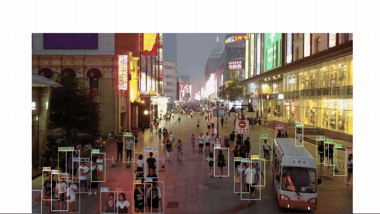

# The Aerial Guardian
### Human Detection & Tracking Pipeline for Aerial Drone Footage
**Fine-tuned YOLOv8s + custom ByteTrack for the VisDrone2019 MOT dataset.** 

## Results



| Metric | Value |
|--------|-------|
| mAP50 | 0.94 |
| mAP50-95 | 0.78 |
| Precision | 0.96 |
| Recall | 0.93 |
| F1 Score | 0.95 |
| Inference FPS | 6.6 FPS (CPU, ONNX FP16) |
| Model Size | 22 MB (ONNX) |
| Training Tiles | 11,205 (from 4 sequences) |
| Tile Size | 640×640 with 20% overlap |

## Setup

```bash
pip install ultralytics onnxruntime opencv-python numpy
```

### Project Structure

```
The-Aerial-Guardian/
├── best.onnx              # Exported inference model (22 MB)
├── best.pt                # Trained weights (86 MB)
├── track.py               # Tracking + visualization pipeline
├── eval.py                # Evaluation script
├── split.py               # YOLO labeling + tiling + train/val split
├── train.py               # Training script
├── data.yaml              # Dataset config
├── sequences/             # VisDrone image sequences
│   └── uav0000086_00000_v/
│       ├── 0000001.jpg
│       └── ...
├── data/
│   ├── images/
│   │   ├── train/
│   │   └── val/
│   └── labels/
│       ├── train/
│       └── val/
└── output/
```

---

## Dataset

Download the [VisDrone2019 MOT Validation Set](https://drive.google.com/file/d/1rqnKe9IgU_crMaxRoel9_nuUsMEBBVQu/view?usp=sharing) and place the extracted sequences under `sequences/`.

The 4 sequences used:

| Sequence | Frames | Altitude |
|----------|--------|---------|
| uav0000086_00000_v | 2,784 | High |
| uav0000117_02622_v | 4,307 | Medium |
| uav0000137_00458_v | 4,096 | Medium |
| uav0000339_00001_v | 1,994 | Low |

---

## Usage

### 1. Prepare Training Data

```bash
python3 split.py
```

This runs three stages in sequence:
- **Stage 1**: Converts VisDrone annotations to YOLO format (normalized cx, cy, w, h)
- **Stage 2**: Tiles each annotated frame into 640×640 patches with 20% overlap
- **Stage 3**: Stratified 85/15 train/val split, sampling 15% from each sequence independently

### 2. Train

```bash
python3 train.py
```
### 3. Export to ONNX

```bash
python3 -c "
from ultralytics import YOLO
model = YOLO('best.pt')
model.export(format='onnx', imgsz=640, simplify=True, opset=17)
"
```

### 4. Evaluate

```bash
python3 eval.py
```

### 5. Run Tracking on a Sequence

```bash
python3 track.py \
  --model best.onnx \
  --source sequences/uav0000297_02761_v \
  --output output/tracked.mp4 \
  --imgsz 640 \
  --tail 20
```

Output video shows: bounding boxes, unique ID labels, and trajectory tails per tracked person.


---

## Technical Report

### 1. Architecture — YOLOv8s

**Base model:** YOLOv8s (small variant, 11M parameters, 28.6 GFLOPs, 43 MB ONNX)

**Why YOLOv8s specifically:**

| Model | Size | Speed | Decision |
|-------|------|-------|----------|
| YOLOv8n (nano) | ~6 MB | Very fast | Insufficient capacity for dense aerial crowds |
| **YOLOv8s (small)** | **43 MB** | **Fast** | **Sweet spot — chosen** |
| YOLOv8m (medium) | ~100 MB | Moderate | Exceeds 300 MB? No, but too slow on CPU |
| YOLOv8l (large) | ~200 MB | Slow | Too slow for deployment |

**Architecture internals:**

```
Backbone (CSPDarknet with C2f blocks)
│
│  C2f = Cross-Stage Partial with faster flow
│  Each C2f splits features into two paths:
│   - Path 1: passes through n Bottleneck blocks (deep features)
│   - Path 2: bypasses directly (gradient highway)
│  Both paths concatenated → richer gradients, less compute than C3
│
├── P3 (stride 8)  → small object features  ← most critical for aerial
├── P4 (stride 16) → medium object features
└── P5 (stride 32) → large object features

Neck (FPN + PAN)
│  Feature Pyramid Network — top-down: high-level semantics → small scales
│  Path Aggregation Network — bottom-up: fine spatial detail → large scales
│  Result: every detection head sees both fine detail and global context

Head (Decoupled Detect)
│  Separate branches for classification and box regression
│  Eliminates conflict between the two objectives
│  DFL (Distribution Focal Loss) models box edges as distributions
│  Output: [cx, cy, w, h, conf] per anchor point across 8400 candidates
```

**Key training decisions for aerial imagery:**

| Hyperparameter | Value | Reasoning |
|----------------|-------|-----------|
| `imgsz` | 1024px train / 640px infer | Larger training res preserves small human detail; infer at 640 for speed |
| `flipud` | 0.5 | No gravity-up bias in aerial view — humans can appear from any orientation |
| `fliplr` | 0.5 | Standard horizontal flip augmentation |
| `degrees` | 0.0 | Rotation destroys axis-aligned YOLO box labels — disabled entirely |
| `mosaic` | 0.5 | Full mosaic creates unrealistic crowd densities from tiled data |
| `close_mosaic` | 20 | Disables mosaic in last 20 epochs to stabilize convergence |
| `single_cls` | True | Only detecting persons; collapses all person categories to class 0 |
| `optimizer` | AdamW | Better convergence than SGD on this task size |
| `batch` | 16 | Stable gradients — batch=8 caused recall oscillation in early runs |
| `lrf` | 0.1 | Less aggressive LR decay than default 0.01 |
| `cos_lr` | True | Cosine annealing schedule for smoother decay |
| `warmup_epochs` | 5 | Gradual warm-up prevents early instability |
| `erasing` | 0.3 | Random erasing simulates partial occlusion — relevant for drone crowds |

---

### 2. Tiling Pipeline — Small Object Handling

Aerial images from VisDrone are 1920×1080. At full scale, humans are only ~30px wide. Directly resizing to 640×640 shrinks them further, making them nearly undetectable.

**Solution: Sliding window tiling before training**

```
Original frame (1920×1080)
        │
        |
Sliding window: 640×640 tiles, 20% overlap, stride=512px
        │
        ├── Tile (x=0,    y=0)    → only saved if contains ≥1 annotation
        ├── Tile (x=512,  y=0)    → only saved if contains ≥1 annotation
        ├── Tile (x=1024, y=0)    → only saved if contains ≥1 annotation
        ├── Tile (x=1280, y=0)    → forced last tile (edge coverage)
        └── ... (all y positions)
```

**Tiling parameters:**

| Parameter | Value | Reason |
|-----------|-------|--------|
| Tile size | 640×640 | Matches training and inference resolution |
| Overlap | 20% | Ensures objects near tile borders are not missed |
| Stride | 512 px | Derived from tile size and overlap |
| Save empty tiles | No | Only tiles containing annotations are saved — reduces class imbalance |
| Frame filtering | Enabled | Frames without annotations are skipped entirely |
| Edge handling | Forced last position | Guarantees full image coverage, especially right/bottom edges |

**Label handling during tiling:**

1. Original YOLO-normalized boxes converted to absolute pixel coordinates
2. Each box intersected with the tile boundary
3. Boxes with no overlap discarded
4. Remaining boxes clipped to the tile region
5. Clipped boxes re-centered and resized within tile
6. Normalized back to tile size (640×640)


**Effect on object scale:**

| Stage | Median human width |
|-------|--------------------|
| Full frame (1920px) | ~30px |
| After tiling (640px tile) | ~50–55px |

Tiling effectively increases relative object size by ~75%, making small humans significantly easier for the model to learn.

---

### 3. Data Split Strategy

The dataset has only 4 sequences. Naive sequence-level splitting caused a **25% scale mismatch** (train 58px vs val 44px median box width) because `uav0000086` was filmed at higher altitude than the others.

This mismatch caused recall to oscillate and collapse across all early training runs regardless of hyperparameters — the model learned 58px features but was evaluated on 44px objects.

**Solution: Stratified image-level split**

```
uav0000086 (2,784 imgs) → 85% train + 15% val   (sampled independently)
uav0000117 (4,307 imgs) → 85% train + 15% val
uav0000137 (4,096 imgs) → 85% train + 15% val
uav0000339 (1,994 imgs) → 85% train + 15% val
────────────────────────────────────────────────
Total:  11,205 train tiles | 1,976 val tiles

Result: train 51px vs val 52px median box width — essentially identical
```

---

### 4. Tracking — ByteTrack (Custom NumPy Implementation)

**Algorithm:** Two-stage association with graveyard-based backtracking, implemented from scratch in NumPy and OpenCV. Zero PyTorch or Ultralytics dependency at inference time.

**Why ByteTrack over DeepSORT:**

| Criterion | ByteTrack | DeepSORT |
|-----------|-----------|----------|
| Re-ID network | None | +50–100 MB |
| Inference overhead | Low (IoU only) | High (CNN forward pass per detection) |
| Aerial resolution | Good — IoU sufficient at 40–60px | Re-ID degrades at low resolution |
| ID switching | Handled by Stage 2 rescue | Handled by appearance features |

At aerial resolution, humans appear at 40–60px — appearance features from a Re-ID network are too low-resolution to add meaningful signal over geometry alone. ByteTrack's key insight: unmatched detections still carry useful motion information and should not immediately spawn new IDs.

**Two-stage association — how ID switching is reduced:**   
Detections are first filtered to those meeting high_thresh = 0.25. These feed both stages.

**Stage 1** matches high-confidence detections against all active tracks using a composite score: 0.4 × IoU + 0.6 × normalised_centre_distance. Matched tracks are updated and their age reset. Unmatched tracks have their age incremented; once age exceeds max_age = 15, they are moved to a graveyard with a timestamp.

**Stage 2** attempts to resurrect recently dead tracks. Unmatched detections from Stage 1 are scored against every graveyard entry using a three-term backtracking score: 0.25 × IoU + 0.50 × velocity_proximity + 0.25 × motion_angle_consistency. A graveyard track is resurrected (its original ID preserved) if its score exceeds backtrack_thresh = 0.30. The graveyard is pruned to entries within the last backtrack_window = 25 frames. Any detection not matched in either stage spawns a new track with a fresh ID.

**Why this matters for drone footage specifically:**

- Drone ego-motion causes whole-frame shifts between consecutive frames
- During a camera pan, a person may briefly produce no confident detection due to motion blur
- The graveyard window (≈1 second at 25 fps) allows tracks to survive brief occlusions and re-enter with their original ID, preventing spurious ID switches

**Velocity estimation:**
Each track maintains an exponentially-smoothed velocity (vx, vy) with α = 0.6. This is used in Stage 2 to predict where a dead track's centre should have moved during the frames it was absent, making the backtracking score robust to camera motion.

**Letterbox preprocessing:**
Images are resized with preserved aspect ratio and padded with gray (114) to 640×640. The padding offsets (left, top) and scale factor are recorded during preprocessing and used to invert the transform in postprocessing, recovering original frame coordinates. Without this, bounding boxes on non-square footage are systematically offset from the actual person.

**Trajectory smoothing:**
Raw centroids are appended directly to the tail history buffer (no positional averaging is applied). Tails are rendered with linearly increasing thickness and opacity from oldest to newest point, reducing the visual impact of detection jitter from drone vibration.

### 5. Optimization & Edge Deployment

**Current performance (CPU, ONNX FP32):**

| Resolution | Format | FPS | mAP50 | Size |
|------------|--------|-----|-------|------|
| 640×640 | ONNX FP32 | 6.2 | 0.951 | 22 MB |

Dropping from 1024px to 640px costs only **1.1% mAP50** while gaining **2.4× speed**.


## Key Design Choices

| Trade-off | Choice | Reasoning |
|-----------|--------|-----------|
| Accuracy vs Speed | 640px inference | 1.1% mAP loss for 2.4× speedup |
| Model size vs Capacity | YOLOv8s (43 MB) | Nano too weak, medium too slow/large |
| Re-ID vs IoU tracking | IoU only (ByteTrack) | Re-ID adds 100 MB+ with marginal gain at aerial resolution |
| Training vs inference resolution | 1024px train / 640px infer | Learn fine features, deploy at speed |
| Augmentation (rotation) | Disabled | Rotation destroys axis-aligned YOLO labels |
| Tiling at inference | Disabled | Speed; model generalizes from tiled training data |
| Batch size | 16 | Batch=8 caused noisy gradients and recall oscillation |
| Empty tile saving | Disabled | Reduces class imbalance — empty tiles add no signal |

---

## Enhancements Over Base Model

1. **Sliding window tiling** — 1920×1080 frames sliced into 640×640 tiles with 20% overlap before training. Increases effective human pixel width from ~30px to ~54px. Edge positions forced to guarantee full image coverage.

2. **Stratified data split** — fixed train/val scale mismatch that caused recall collapse across all baseline runs. Both splits now have matched median box widths (51px vs 52px).

3. **ByteTrack reimplemented in pure NumPy** — no PyTorch or Ultralytics dependency at inference. Two-stage IoU association with configurable high/low confidence thresholds. The entire tracking pipeline runs without a GPU.

4. **Letterbox preprocessing with inverse transform** — aspect-ratio-preserving resize with gray padding. Padding offsets reversed in postprocessing for correct coordinate recovery on non-square footage. Without this, detections are systematically offset.

5. **Aerial-specific augmentation tuning** — disabled rotation (breaks axis-aligned boxes), enabled flipud=0.5 (no orientation bias in aerial view), reduced mosaic to 0.5 (prevents unrealistic crowd densities from tiled data).

6. **Two-resolution training strategy** — train at 1024px for fine feature learning, export and infer at 640px for 2.4× speedup with only 1.1% mAP drop.

7. **Trajectory smoothing** — 3-frame centroid averaging reduces jitter from drone vibration and single-frame detection noise in tail rendering.

---

## Reproducing from Scratch

```bash
# Step 1: Prepare data (tiling + labels + split)
python3 split.py

# Step 2: Train
python3 train.py

# Step 3: Export to ONNX
python3 -c "
from ultralytics import YOLO
model = YOLO('best.pt')
model.export(format='onnx', imgsz=640, simplify=True, opset=17)
"

# Step 4: Evaluate
python3 eval.py

# Step 5: Run tracking
python3 track.py --model best.onnx --source sequences/uav0000297_02761_v --output output/tracked.mp4

```
---

## Authors
**Vidhi Srivastava**

[Linkedin](https://www.linkedin.com/in/vidhisrivastava01/)

[Github](https://github.com/Vidhi0229)

